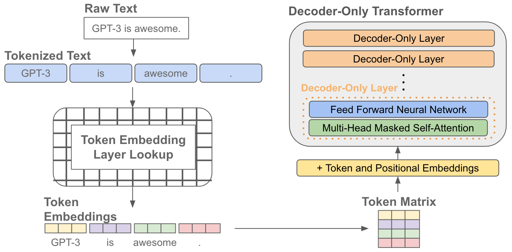

*Authors: Bezawit Abebaw and Biruk Abere*

## **BERT (Bidirectional Encoder Representations from Transformers)**

BERT is a popular language model introduced by Google. BERT is designed to pre-train deep bidirectional representations from unlabeled text by considering both left and right context in all layers. This allows BERT to capture contextual information and generate rich representations of words.

One of the key advantages of BERT is that it can be fine-tuned for various downstream tasks with minimal modifications. After pre-training on a large corpus of unlabeled text, BERT can be easily adapted to different tasks by adding just one additional output layer. This fine-tuning process enables BERT to achieve state-of-the-art performance in a wide range of natural language processing tasks, including question answering, language inference, sentiment analysis, and more.

There are  two steps involved in the framework of BERT: pre-training and fine-tuning.

### **Pre-Training BERT**

During the pre-training phase, the BERT model is trained on a large corpus of unlabeled data using different pre-training tasks. These pre-training tasks typically involve predicting missing words (masked language modeling) or determining the relationship between sentence pairs (next sentence prediction). By training on these tasks, the model learns contextual representations that capture the relationships and meanings of words in a given sentence.

BERT does not rely on traditional left-to-right or right-to-left language models for pre-training. Instead, BERT employs two unsupervised tasks as part of its pre-training process.

**Masked Language Modeling (MLM)**: During pre-training, a certain percentage of the input tokens in a sentence are randomly masked. The model is then trained to predict the original masked tokens based on the context provided by the surrounding tokens. By training on this masked language modeling objective, BERT learns to understand and infer the meaning of words in their given context. This allows BERT to capture bidirectional dependencies and generate contextualized representations for each token.

**Next Sentence Prediction (NSP)**: The second unsupervised task in BERT's pre-training is next sentence prediction. This task involves providing pairs of sentences as input, where the model is trained to predict whether the second sentence follows the first sentence in the original text or not. This objective helps BERT learn to understand the relationships between sentences and grasp the overall coherence and context of the text.

These pre-training tasks are designed to help BERT learn a rich context-aware representation of language, which can then be fine tuned on a smaller dataset for various downstream tasks like sentiment analysis, name entity recognition and more. Pre-training on a large corpus of text allows BERT to capture a wide range of language nuances and patterns before being specialized through fine-tuning.  

### **Input Representation**

**Tokenization**: The input text is first tokenized into individual tokens. BERT uses a technique called WordPiece tokenization, where words are split into subword units. For example, the word "playing" can be split into "play" and "##ing". This tokenization helps BERT handle out-of-vocabulary words and capture subword-level information.

**Special Tokens**: BERT adds special tokens to the tokenized input. The [CLS] token is inserted at the beginning of the input sequence, and a [SEP] token is placed between sentence pairs to indicate separation. Additionally, BERT may use other task-specific special tokens as needed.

**Segment Embeddings**: BERT supports tasks involving sentence pairs, such as sentence classification or question answering. To differentiate between the two sentences in the input, BERT assigns a segment embedding to each token. Tokens corresponding to the first sentence receive one segment embedding, while tokens from the second sentence receive a different segment embedding.

For instance, Imagine we have two different colored highlighters, and you’re highlighting a printed conversation between two people. You could use one color for Person A’s lines and a different color for Person B’s lines. When we read conversation, the colors help to quickly see who is speaking.

* **E_A Segment Embeddings**: These are like the first color of highlighter. They are added to every token (word or subword) that belongs to the first part of the input to BERT. If the input is “My dog is cute. He likes playing” and “My dog is cute” Is the first part, every token in this part would get the “E_A” embedding added to it. 

* **E_B Segment Embeddings**: These act like the second color of highlighter. They are added to every token that belongs to the second part of the input. Following our example,”He likes playing” would be considered the second part, and every token in this part would have “E_B” embedding

**Positional Encoding**: BERT incorporates positional information by adding positional encodings to the input embeddings. These encodings provide the model with information about the relative positions of tokens in the input sequence.

BERT comes in two main variants: BERT_BASE and BERT_LARGE. These variants differ in terms of their model size, number of parameters, and computational requirements.

**BERT_BASE** is the smaller variant of the BERT model. It consists of 12 transformer layers, where each layer has 12 self-attention heads. The total number of parameters in the BERT base is around 110 million. BERT base is considered a powerful model and has been widely used in various natural language processing tasks. It provides strong contextual representations and performs well across a range of applications.

**BERT_LARGE** is the larger variant of the BERT model. It is more computationally expensive and resource-intensive compared to BERT_BASE. BERT_LARGE consists of 24 transformer layers, with each layer having 16 self-attention heads. The total number of parameters in BERT_LARGE is approximately 340 million, making it significantly larger than BERT_BASE. Due to its increased size, BERT_LARGE has the potential to capture even more complex linguistic patterns and dependencies.

The choice between them depends on the specific requirements of the task at hand. BERT_LARGE tends to perform better than BERT_BASE on certain complex tasks or datasets with large-scale language understanding challenges. However, BERT_LARGE also requires more computational resources and longer training times compared to BERT_BASE. Therefore, BERT_BASE is often a more practical choice for many applications, as it strikes a good balance between performance and resource requirements.

Both models are made up of multiple encoder layers stacked on top of each other. These layers are responsible for the model's ability to understand context and meaning from text data. Each layer includes self-attention mechanisms and feed-forward neural networks, allowing the model to learn from the context of words within a sentence as well as the relationships between sentences.

### **Fine-Tuning BERT**

After pre-training, the BERT model is initialized with the learned parameters. In the fine-tuning phase, the model is further trained using labeled data specific to downstream tasks. The parameters of the model, including both the pre-trained and task-specific parameters, are updated or fine-tuned using gradient-based optimization methods such as backpropagation. Each downstream task requires a separate fine-tuned model, even though they all start with the same pre-trained parameters. Fine-tuning allows the model to adapt its learned representations to the specific task at hand, improving its performance on that task.

During fine-tuning, BERT can be trained on specific natural language processing (NLP) tasks by replacing the fully connected output layer of the model with task-specific output layers. When fine-tuning BERT for a particular NLP task, the original pre-trained BERT model, which has already learned contextualized representations, is adapted to the specific task by training on labeled data. By replacing the output layer and fine-tuning on labeled data, BERT can be effectively customized and tailored to various NLP tasks. 
## **RoBERTa (Robustly Optimized BERT Pre-Training Approach)**

RoBERTa is a transformer-based language model that processes information by using self-attention. It has been demonstrated to perform better on a range of NLP tasks, including language translation, text categorization, and question answering, than BERT. It builds on BERT and modifies key hyperparameters, removing the next-sentence pretraining objective and training with much larger mini-batches and learning rates. 

RoBERTa utilizes a similar architecture to BERT but incorporates several enhancements and optimizations. It is trained on a large amount of unlabeled text data to learn general language representations. This pretraining process helps RoBERTa capture a deeper understanding of syntax, semantics, and context in language.

**How does the RoBERTA model work?**

RoBERTa is a transformer-based language model that is trained on a large corpus of text data. This corpus typically consists of a vast amount of publicly available text from sources like books, websites, and articles.The text data is tokenized into smaller chunks called tokens. Tokens can be as short as a character or as long as a word or subword. For example, the sentence "I love cats" might be tokenized into ["I", "love", "cats"].

Each token is then converted into its corresponding numerical representation called an embedding. These embeddings capture the semantic information of the token. RoBERTa uses byte-level byte pair encoding (BPE) to tokenize and represent the input.
RoBERTa is based on the transformer architecture.  Each transformer layer has two sub-layers: a multi-head self-attention mechanism and a feed-forward neural network. Self-attention allows the model to weigh the importance of each token in the context of the whole sentence. It computes attention scores between all pairs of tokens and generates a context-aware representation for each token. The output from the self-attention mechanism is passed through a feed-forward neural network. This network applies non-linear transformations to the token representations, capturing complex relationships and patterns in the data.

RoBERTa uses a masked language modeling (MLM) objective during pre-training. In MLM, a certain percentage of tokens in the input text are randomly masked, and the model is trained to predict the original masked tokens. This objective helps RoBERTa learn contextual representations that capture the relationships between words and their surrounding context. After pretraining, RoBERTa can be fine-tuned on specific downstream tasks such as text classification, named entity recognition, or question answering. During fine-tuning, additional task-specific layers are added on top of the pretrained RoBERTa model, and the entire model is trained on labeled task-specific data.

**Comparing RoBERTa to BERT**

**Dynamic Masking**

In the original BERT implementation, masking is done during the data preprocessing stage. This means that before BERT tries to understand a piece of text, it hides some words by replacing them with special markers. This results in a fixed pattern of hidden words that remains the same every time BERT processes a new sequence.

However, RoBERTA uses a dynamic masking approach. Instead of using a fixed pattern, it creates a new pattern of hidden words each time it encounters a new sequence which is slightly better than static masking.

**No Next Sentence Prediction**

In the original BERT model, training involved predicting whether two sentences were related or not. This was done by taking pairs of sentences from different stories and asking the model to determine their relationship. This task is known as Next Sentence Prediction.

RoBERTa, on the other hand, removes the NSP task during pre-training. The researchers found that the NSP objective was not consistently helpful and sometimes led to suboptimal performance on downstream tasks. By removing NSP, RoBERTa can focus solely on the masked language modeling (MLM) objective, where it predicts masked tokens in the input sequence.

Instead of NSP, RoBERTa introduces two new training techniques called "doc-sentence" and "full-sentence" training.
In doc-sentence training, RoBERTa trains on contiguous spans of text from documents, allowing the model to capture dependencies within the same document. This helps the model learn to understand the context and relationships between sentences within a document.
In full-sentence training, RoBERTa splits long documents into chunks, treating each chunk as an individual training example. By training on full sentences rather than sentence pairs, RoBERTa can capture the entire context of the sentence without relying solely on the relationship between adjacent sentences. This enables the model to better comprehend document-level semantics.

**Training with large batches**

RoBERTa is trained on a significantly larger dataset compared to BERT. It is trained on 160GB of text data, which is approximately 40 times larger than the dataset used to train BERT. This larger dataset allows RoBERTa to learn from a more diverse and extensive range of text, potentially improving its ability to capture language nuances and generalization. Due to the larger dataset, training RoBERTa typically requires more computational resources and time compared to BERT. The increased training duration allows RoBERTa to undergo more iterations and updates, potentially leading to better convergence and improved performance.

The larger training dataset of RoBERTa helps it capture a broader range of language patterns, leading to improved performance on various downstream tasks. RoBERTa has demonstrated better results compared to BERT on several benchmarks and NLP tasks, showcasing the benefits of training on a larger dataset.

**Text Encoding**

RoBERTa breaks down input text into smaller subword units called tokens. When encoding a text sequence, RoBERTa tokenizes it by splitting it into individual tokens. Punctuation marks are typically treated as separate tokens. For example, the sentence "I love dogs!" might be tokenized as ["I", "love", "dogs", "!"].

RoBERTa uses larger byte-level BPE vocabulary with 50K subword units instead of character-level BPE vocabulary of size 30K used in BERT. When we work with natural language, we need a way to represent words and characters so that machine learning models can understand them. One popular method is called byte-pair encoding (BPE). BPE is a way of breaking down words into smaller subword units. In the original BERT model, they used a BPE vocabulary with 30,000 subword units. However, researchers found that using a larger vocabulary could be even more beneficial.

So, in RoBERTa, they decided to use a larger byte-level BPE vocabulary with 50,000 subword units. This means that the vocabulary can handle even more variations and combinations of characters and words. It can represent a wider range of language patterns and help RoBERTa understand and generate more diverse text.

## **DistilBERT**

DistilBERT, also known as Distilled BERT, is a compressed and more lightweight version of the BERT model. It aims to retain much of BERT's performance while reducing its size and computational requirements.

The DistilBERT model achieves compression by applying knowledge distillation. It is trained using a two-step process: first, a large BERT model (the teacher) is trained on a large amount of text data, and then a smaller DistilBERT model (the student) is trained to mimic the behavior of the teacher model.

**Comparing DistilledBERT to BERT**

**Model Architecture**

DistilBERT has a similar architecture to BERT but with a reduced number of layers and parameters. While BERT has typically 12 or 24 transformer layers, DistilBERT typically has 6 transformer layers. Reducing the model's depth results in a smaller memory footprint and faster inference time.

**Knowledge Distillation**

DistilBERT is trained using a process called knowledge distillation. It is a technique used to compress a large and complex model into a smaller and more compact model. The goal is to transfer the knowledge and performance of the teacher model to the student model, making the student model more efficient for deployment on devices with limited resources.

In traditional supervised learning, a model is trained to predict the correct answer for each input by maximizing the probability of the correct answer. The model's predictions are compared to the one-hot labels, which indicate the correct class. However, in knowledge distillation, the smaller model is trained not only to match the correct answer but also to mimic the larger model's behavior and predictions.

To train the student model, cross-entropy loss function is commonly used. The cross-entropy measures the difference between the predicted probability distribution of the smaller model and the soft targets generated by the larger model. When a model is well-trained, it assigns a high probability to the correct class and low probabilities to other classes. However, some of these "near-zero" probabilities may have different magnitudes, indicating how confident the model is in its predictions and its ability to generalize well to unseen examples.

**Reduced Vocabulary Size**
DistilBERT typically uses a smaller vocabulary compared to BERT. This reduction in vocabulary size further helps reduce the memory requirements and inference time of the model. Two specific parts from DistilBERT: the token-type embeddings and the pooler were removed. By doing this, DistilBERT was made smaller and faster. The number of layers in DistilBERT were reduced by half compared to BERT. By reducing the number of layers, DistilBERT became more compact while still retaining important functionality.

## **GPT (Generative Pre-trained Transformer)**

GPT  is a state-of-the-art language model that utilizes the transformer architecture for natural language processing tasks. It is a deep learning model that has achieved remarkable success in various language-related tasks, including language generation, text completion, question answering, and more. 

Similar to other transformer-based models, GPT undergoes a pre-training phase where it learns from large amounts of unlabeled text data. During pre-training, the model learns to predict missing or masked words within sentences. After pre-training, GPT can be fine-tuned on specific downstream tasks using labeled data, enabling it to perform task-specific language processing.

### **Evolution of GPT**

The continuous improvement of the GPT model can be attributed to several factors, including advancements in its architecture, increased availability of computing power, and the development of novel techniques for fine-tuning. These advancements have led to the creation of larger and more powerful GPT models that can perform a wider range of NLP tasks with remarkable accuracy and fluency.

GPT-1, released in 2018, was the first model capable of comprehending text and responding to queries. It employed a 12-layer decoder architecture transformer and achieved success in zero-shot learning tasks. Transfer learning served as the foundation for GPT models, enabling them to perform NLP tasks with minimal fine-tuning. This progress has paved the way for further advancements in generative pre-training using larger datasets and parameters.

In 2019, OpenAI introduced GPT-2, a language model that aimed to improve upon its predecessor. GPT-2 was designed with a larger dataset and significantly more parameters, making it 10 times the size of GPT-1. With 1.5 billion parameters, GPT-2 demonstrated remarkable performance on various language tasks without the need for extensive training examples. It proved effective in tasks such as translation and summarization. Notably, GPT-2 excelled in recognizing long-distance relationships and predicting sentences, resulting in increased accuracy. The evaluation of GPT-2 on downstream task datasets highlighted its advancements in understanding and generating language.

GPT-3 is the latest iteration of the GPT model developed by OpenAI. It is a powerful language prediction and production model that can generate lengthy passages of text that closely resemble human writing. GPT-3 is available through a cloud-based API, and its extensive capacity of 175 billion parameters (100 times larger than GPT-2) is a significant advantage. It is trained on a massive corpus of 500 billion words called "Common Crawl" gathered from the internet and various content archives. In addition to its language capabilities, GPT-3 can perform basic math operations, write code snippets, and carry out clever tasks. This makes it useful for businesses to respond quickly and accurately, ensuring adherence to best practices and reducing human errors.

OpenAI has released several AI models based on GPT-3.5, an upgraded version of GPT-3. GPT-3.5 was trained on a combination of text and code, using a large amount of data from the web, including Wikipedia entries, social media posts, and news items. OpenAI utilized GPT-3.5 to develop specialized systems for specific tasks.

The latest version of the GPT model is GPT-4, a multimodal large language model. It was publicly launched on March 14, 2023, and is available to the general public through ChatGPT Plus in a limited capacity. GPT-4 was pre-trained using public data and data licensed from third-party providers to predict the next token as a transformer. It was then fine-tuned through reinforcement learning based on input from both humans and AI to align with human behavior and policies. Compared to GPT-3, which had context windows of 4096 and 2049 tokens, GPT-4 offers two variations with larger context windows of 8192 and 32768 tokens.

GPT is a unidirectional language model, meaning it predicts each word based solely on the previous words. In contrast, bidirectional models like BERT consider both previous and following words for context. GPT models are built on neural networks and commonly used for NLP tasks such as language modeling, text classification, and text generation.

The architecture of the GPT model is based on the transformer model. Transformers utilize self-attention mechanisms, allowing them to process input sequences of varying lengths effectively. This makes transformers well-suited for NLP tasks. GPT simplifies the transformer architecture by using decoder blocks instead of encoder-decoder blocks.

The GPT model undergoes a pre-training phase in which it is trained on large amounts of text data using unsupervised learning techniques. This pre-training process enables the model to learn representations of natural language. These learned representations can be further fine-tuned for specific downstream tasks, adapting the model to perform well on tasks such as summarization, translation, or sentiment analysis.

### **How do GPT models work?**

GPT models work by utilizing a decoder-only transformer architecture, which means they lack an encoder component. The decoder takes the output from the transformer blocks and generates the output sequence word by word. At each step, the model predicts the probability distribution over the vocabulary for the next word and samples from this distribution to generate the next token. This process is known as autoregression.

The input to the GPT model consists of a sequence of tokens, where each token represents a word or a subword unit. These tokens are converted into continuous vector representations called embeddings using an embedding layer. The embeddings capture the semantic meaning and contextual information of the input tokens.

To incorporate positional information, GPT adds positional encodings to the token embeddings. These positional encodings are learned and provide the model with information about the relative positions of the words in the input sequence. By combining the token embeddings with positional encodings, the model can understand the context and sequence of the input tokens.

During training, GPT models are pre-trained on large amounts of text data using unsupervised learning. This pre-training phase helps the model learn general language patterns, grammar, and semantic relationships. The model is trained to predict the next word in a sequence given the previous words.

Once pre-training is complete, the model can be fine-tuned on specific downstream tasks. Fine-tuning involves training the model on task-specific labeled data, adjusting the model's parameters to optimize its performance on the particular task at hand.

## **Text-To-Text Transfer Transformer (T5)**

Text to text transformers are based on the Transformer architecture, which consists of an encoder and a decoder. The encoder processes the input text and extracts its representations, while the decoder generates the output text based on those representations.

Every task we consider – including translation, question answering, and classification is cast as feeding our model text as input and training it to generate some target text. 
In a typical NLP framework, different tasks might require different models, each with its own architecture, loss function, and set of hyper parameters. This can complicate the development and maintenance of NLP systems. The T5 model allows us to use the same model, loss function, hyper parameters etc across our diverse set of tasks. It simplifies this by treating every task as a text to text problem. 

For instance,
* Translation is treated as converting text from one language to text in other languages.
* Summarization is treated as converting a long text to a short text. 
* Classification is treated as converting text to a class label described in text (e.g :- the sentiment “positive” or “negative” ).
* Regression where the goal is to predict the rating of a product based on a review, the output numerical rating (say on a scale of 1 to 5) can be converted into a text string like “3.8” or “4.5”.

### **Use of T5 model **

**Same Model**: T5 utilizes a single Transformer-based model for processing any task formatted as text input and producing text output. This eliminates the need for specialized architectures for each task, making it a versatile and flexible model.

**Same Loss Function**: T5 employs a standardized loss function, typically a variant of cross-entropy loss, that measures the difference between the predicted text sequence and the actual target sequence. Using the same loss function across tasks allows for a consistent training framework.

**Same Hyperparameters**: Since the model architecture remains unchanged across tasks, the hyperparameters such as batch size, learning rate, and the number of layers in the model can remain consistent. This consistency in hyperparameters simplifies the fine-tuning process for new tasks, as there is no need to start the hyperparameter search from scratch.

### **Model**

Early results on transfer learning for NLP leveraged recurrent neural networks, but it has recently become more common to use models based on the “Transformer” architecture. The Transformer was initially shown to be effective for machine translation, but it has subsequently been used in a wide variety of NLP settings. 

The T5 model follows the encoder-decoder structure. The encoder processes the input text, encoding it into a set of representations that capture the meaning and context of the text. The decoder takes these representations and generates the output text based on them.

**How does the T5 model work?**

The input text is first tokenized, breaking it down into smaller units called tokens. These tokens can represent words, subwords, or characters. Tokenization is essential for the model to process the text effectively. The tokens are then fed into the T5 model for further processing.

The encoder part of the model processes the tokenized input text. It consists of multiple layers of Transformer blocks. Each Transformer block contains two sub-layers: a multi-head self-attention mechanism and a feed-forward neural network.

Within each Transformer block, the self-attention mechanism helps the model capture relationships between different tokens in the input text. It attends to each token in the sequence and assigns weights to other tokens based on their relevance, allowing the model to consider the context and dependencies between tokens.
The feed-forward network helps transform and combine the information obtained from the self-attention layer. It applies non-linear transformations to the token representations, enriching them with contextual information.

To capture the positional information of the tokens, the model uses positional encoding. Positional encoding assigns each token a unique position-based representation that conveys its position in the input sequence. This allows the model to understand the sequential order of the tokens. The decoder part of the model then takes the token representations generated by the encoder and generates the output text based on them.

The model undergoes a two-step training process. First, it is pre-trained on a large corpus of text using unsupervised learning. During pre-training, the model learns to predict masked or corrupted tokens in a given input sequence, which helps it learn general language understanding. Then, the pre-trained model is fine-tuned on specific downstream tasks using task-specific labeled datasets. Fine-tuning allows the model to adapt its knowledge to the specific task.

To specify the desired task to the  model during both pretraining and fine-tuning, task-specific prefixes are prepended to the input text. These prefixes provide explicit instructions about the task type and guide the model to understand the task it needs to perform. For example, if the task is translation, the input text might have a prefix like "translate English to French: "

